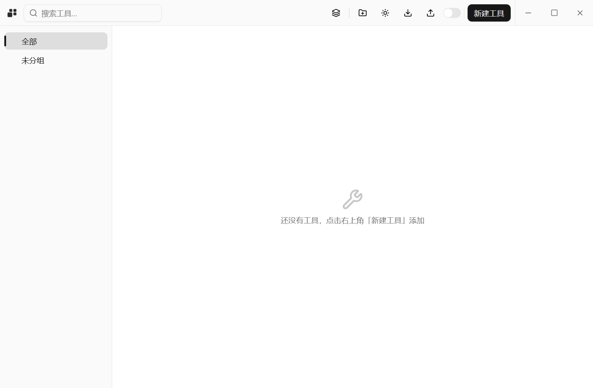
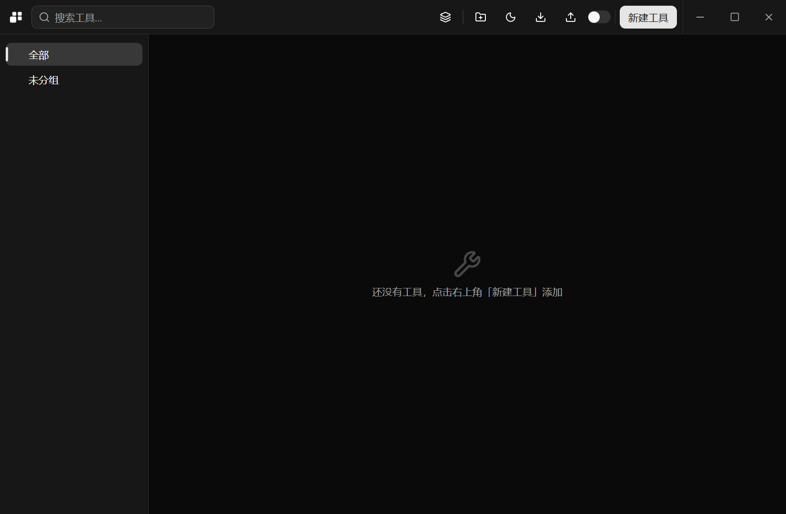

<div align="center">

<picture>
  <source media="(prefers-color-scheme: dark)" srcset="light.png">
  <source media="(prefers-color-scheme: light)" srcset="dark.png">
  
</picture>

# ovo

把散在硬盘各处的脚本、JAR、绿色程序和内网工具页，收进一个面板里统一启动。

Windows · 单文件免安装 · Tauri 2 + Vue 3


</div>

<table>
  <tr>
    <td width="50%"></td>
    <td width="50%"></td>
  </tr>
  <tr>
    <td align="center">浅色主题</td><td align="center">深色主题</td>
  </tr>
</table>

---

## 它解决什么

一台机器上往往同时装着好几个版本的 JDK、好几个 Python，还有一堆「点开文件夹→双击 exe」的绿色工具。
`ovo` 给它们一张卡片：起个名字、归个组、挑好该用哪个运行环境，之后**双击即启动**，或者从系统托盘直接点。

## 六种工具类型

| 类型 | 目标文件 | 怎么跑 |
| --- | --- | --- |
| Terminal Python | `.py` | `cmd /K` 新控制台，窗口保留 |
| Terminal Java | `.jar` | `cmd /K java -jar`，窗口保留 |
| Terminal exe | `.exe` | `cmd /K`，窗口保留 |
| Gui Java | `.jar` | 直接拉起 `javaw.exe` |
| Gui exe | `.exe` | 直接拉起；**仅此类型**支持右键「以管理员身份运行」 |
| Web Link | `http(s)://` | 交给系统默认浏览器 |

工作目录一律取目标文件所在目录，不单独配置——少一个能填错的字段。

## 运行环境

- **Java** 填安装根目录（`java.exe` 在它的 `bin\` 里），**Python** 填 `python.exe` 所在目录。
- 添加时只需选目录：后端跑一次 `java -version` / `python --version`，用版本输出自动命名（`Java 17.0.12`、`Python 3.13.13`），**探测不通过就不入库**——列表里不会留着一条看着能用其实启动必挂的环境。
- Java / Python 类工具**必须**绑定环境，绝不回退系统 `PATH`：系统里装着哪个版本不可控，静默回退只会让「在这台机器能跑」变成假象。
- 终端类启动时会把绑定环境的 `bin` 临时置顶到 `PATH`，只影响这一个子进程。

## 安全设计

终端类工具必须经过一次 `cmd` 解析（保留窗口和注入 PATH 都只能由它做），所以这一路存在命令行注入面。做法是：

1. 程序与每个参数都按 `CommandLineToArgvW` 规则**强制**包双引号，裸的 `& | < > ^ ; =` 于是退化为参数内容；
2. `cmd` 唯一压不住的三类字符直接拒绝执行——双引号（提前闭合引号）、换行（语句分隔符）、`%`（`cmd` 先展开 `%VAR%` 再识别特殊字符，引号保护不了它，实测会让子进程收到整条 `PATH`）；
3. 校验放在**交给 cmd 的那行字符串**上，而不是 argv 数组——只断言数组测不到这一层。

另外：

- 导入的配置文件属于外部输入，因此限制 `.json` 后缀与 4 MB 体积，剔除路径非法的环境（并同步摘掉引用它们的工具绑定），归一化悬空的 `envId` / `groupId` 与重复 id，逐条回报修正了什么；替换前二次确认。
- 前端 CSP 生效（`script-src 'self'`，Tauri 会为其引导脚本追加 `sha256`）；capability 在 `core:default` 之外只额外开了四个窗口控制动作和对话框插件。`opener` 只在 Rust 侧调用，不经过前端权限。
- 提权启动走 `ShellExecuteExW`，能区分「用户拒绝了 UAC」和真的启动失败。

## 数据与可靠性

配置是唯一真源，全部落在 exe 旁边的 `data\`：

```
data/
├── config.json        # 设置、运行环境、分组、工具
├── config.json.bak    # 覆盖写入前的滚动备份
├── window.json        # 窗口尺寸 / 最大化（独立存，避免被整体保存覆盖）
├── icons/             # 从 exe 提取的工具图标（PNG，文件名是目标路径哈希）
└── logs/app.log       # release 无控制台，命令层失败一律先写这里
```

- **原子写**：临时文件 → `write` → `sync_all` → `rename`。多出的 `sync_all` 是为了断电/蓝屏时不留 0 字节或半截 JSON。
- **自愈**：主文件解析失败时，把坏文件改名 `config.json.bak-<时间戳>` 留档，从滚动备份恢复并立刻写回主文件。
- **容错**：枚举用 `#[serde(other)]` 收未知值，已删除的字段被静默忽略——单个不认识的值不该让整份配置被判损坏、进而清空用户的工具列表。
- 界面不再弹浮动通知：结果反馈统一收在底部状态条，失败原因同时进 `app.log`（托盘菜单里可直接打开）。

## 交互细节

- 卡片**双击**启动（单击不触发，避免误启动），右键菜单含启动 / 提权 / 编辑 / 打开工作目录 / 删除。
- 侧栏按分组筛选，色标只做展示；搜索匹配名称与描述。
- 托盘菜单按分组列工具，仅在分组/工具的 id·名称·归属变化时重建，避免每次保存闪一下。
- 关闭窗口可选择「最小化到托盘」或「退出程序」；启动时恢复上次尺寸，但位置一律重新居中。
- 单实例：重复启动只是把主窗口带回来。
- 深浅两套主题，标题栏图标与应用图标都随主题切换色版。

## 开发

```bash
pnpm install
pnpm tauri dev      # 开发（Vite 1420 + 热重载）
pnpm build          # 版本一致性检查 + vue-tsc 类型检查 + 前端产物
pnpm tauri build    # 出单文件 exe（release：LTO + strip）
cd src-tauri && cargo test
```

版本号写在 `package.json`、`src-tauri/tauri.conf.json`、`src-tauri/Cargo.toml` 三处，`pnpm build` 会先跑 `scripts/check-version.mjs` 拦住不一致。

```
src/            Vue 3 + TS 前端（lib/ 放状态与 IPC 封装，components/ui/ 是 shadcn-vue）
src-tauri/src/  Rust 后端：commands / config / launcher / icon / tray / shellex / logging
```

## 已知边界

- **仅 Windows**：依赖 `creation_flags`、`ShellExecuteExW`、GDI 取图标等 Win32 接口。
- 构建**不产出安装包**（`bundle.targets` 为空），只出裸 exe——它本来就靠 `data\` 自包含。
- 没有自动更新；`data\` 需要可写，不可写时保存配置会直接报错，不会悄悄换地方写。
